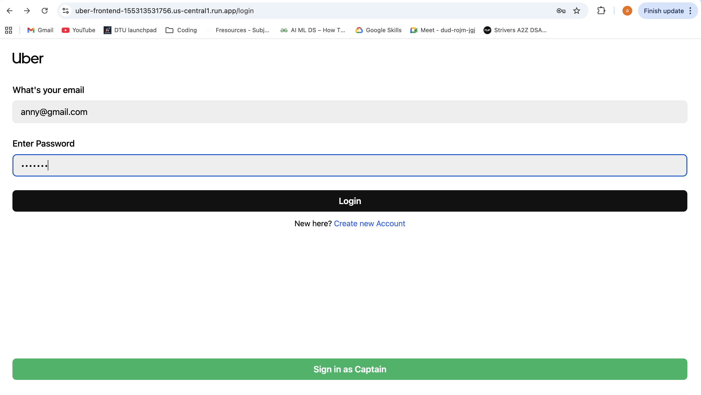
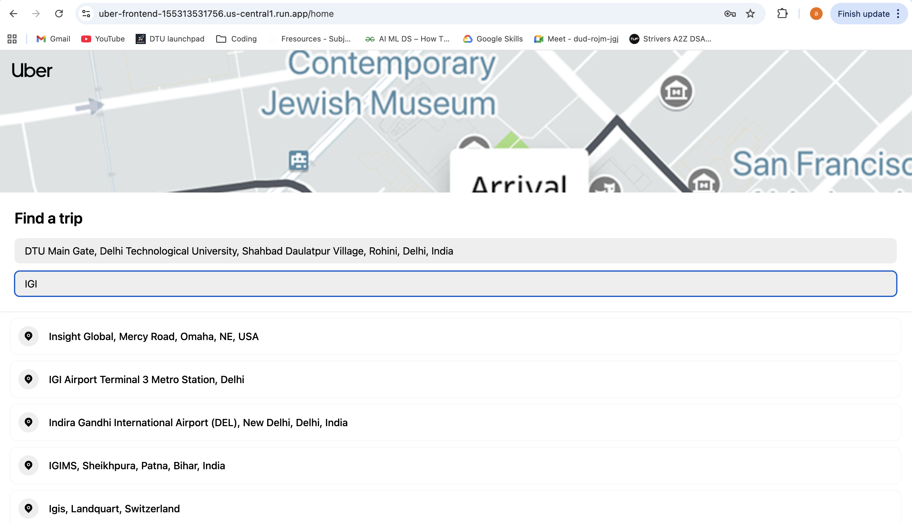
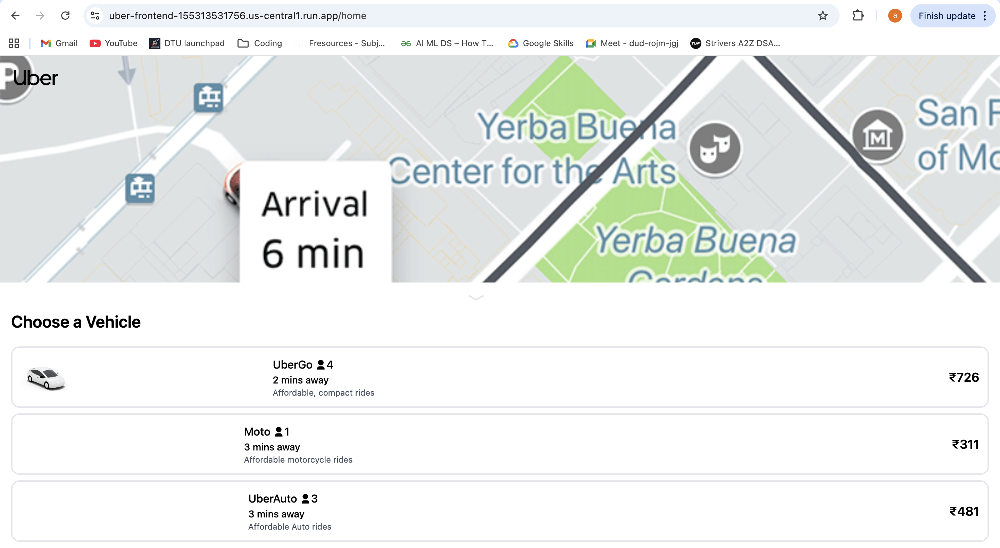
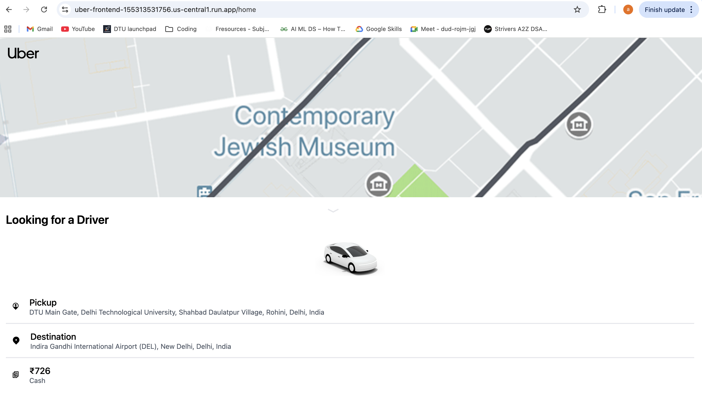
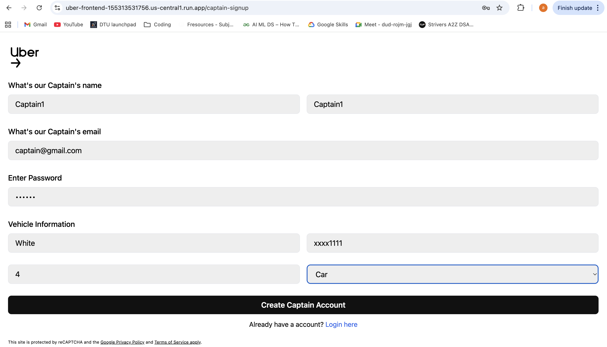
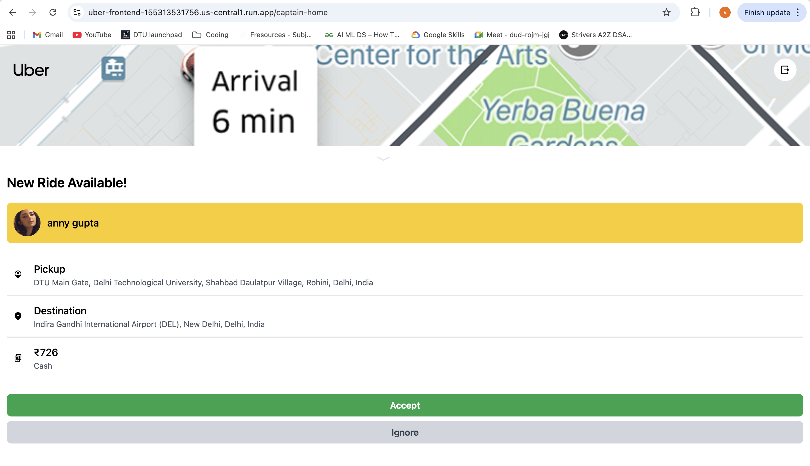
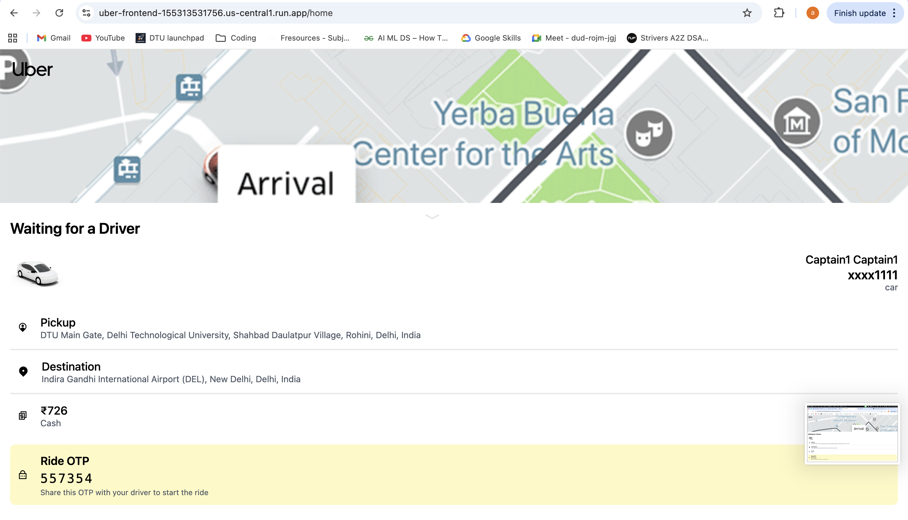
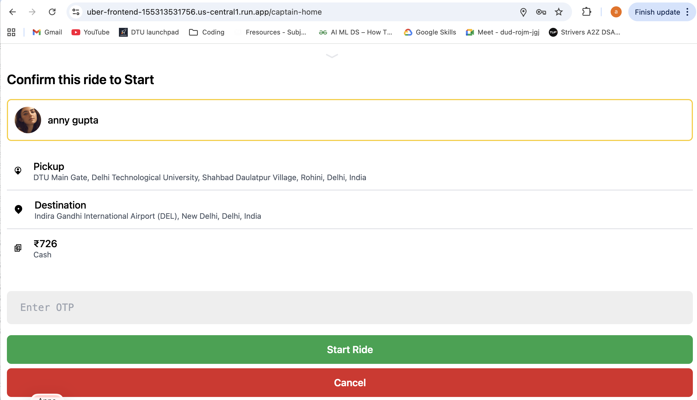
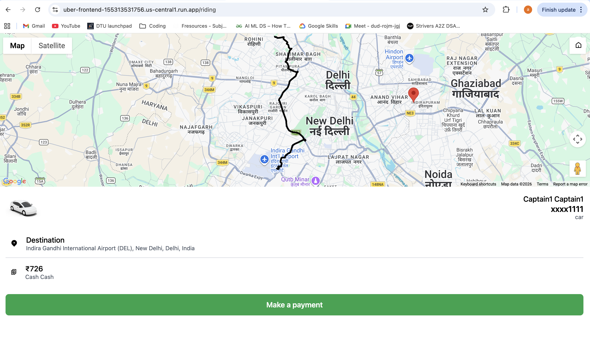
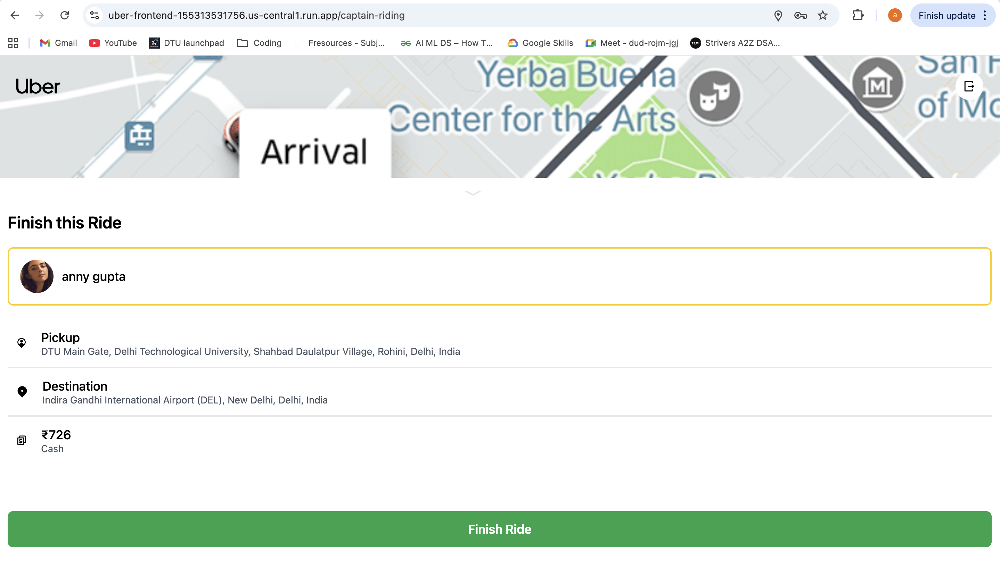

# Real-Time Uber Clone

A full-stack real-time ride-hailing application inspired by Uber, designed to enable low-latency coordination and trip lifecycle management between users and riders.

The system follows production-style architecture using REST APIs, WebSockets, JWT-based authentication, containerization with Docker, and cloud-native deployment on Google Cloud Run.

---

## Tech Stack

**Frontend**  
React (Vite), Tailwind CSS, Google Maps API  

**Backend**  
Node.js, Express.js, MongoDB (Atlas), Socket.IO  

**Authentication & Security**  
JWT, bcrypt, CORS, cookie-parser, Blacklisted Tokens  

**DevOps & Cloud**  
Docker, Docker Compose, Google Cloud Build, Artifact Registry, Cloud Run  

---

## Demo

The application supports two client roles:

### User
- Sign up / Login  
- Search pickup and destination with Google Maps autosuggestions  
- Request rides  
- Receive ride status updates in real time  
- Track captain live on map  
- OTP-secured ride start  

---

### Rider
- Sign up / Login  
- Receive real-time ride requests via WebSockets  
- Accept / Ignore rides  
- Verify OTP to start trip  
- Complete ride lifecycle  

---

### Walkthrough Video  
Quick one-minute demo: [*(video link)*](https://drive.google.com/file/d/1AHjJCWXeXvNGfCfEuIasReHKfN4wBBPO/view?usp=drive_link)

---

## Demo Screenshots

---

### User Experience

| User Login | Location Search |
|--------------|-----------------|
|  |  |

| Vehicle Selection | Looking for Driver |
|-------------------|--------------------|
|  |  |

### Rider Experience

| Rider Signup | Ride Pop Up |
|-------------------|--------------------|
|  |  |

### After Ride Confirmation

| User Waiting for Rider | OTP verification |
|-------------------|--------------------|
|  |  |

### Finish Ride After Payment

| Make Payment & Live Tracking | Finish Ride(Rider)|
|-------------------|--------------------|
|  |  |

---

## Development Phases

---

### Phase 1 – Core Application Development

**Backend**
- Designed MongoDB schemas for users, captains, and rides  
- Built RESTful API architecture using Express.js  
- Implemented custom JWT-based authentication middleware for data privacy and security
- Secured passwords using bcrypt hashing  
- Added Blacklisted Token model to invalidate logged-out sessions to increase security 
- Configured CORS and cookie-parser for secure communication  

**Frontend**
- Developed responsive UI with React and Tailwind CSS  
- Integrated Google Maps API for autosuggestions and tracking  
- Built state aware and context-driven state management  
- Implemented protected routes using custom authentication wrappers for role-based access  
- Created dynamic ride lifecycle panels  

---

### Phase 2 – Containerization & Environment Isolation

- Dockerized frontend and backend as independent services  
- Implemented multi-stage frontend build with Nginx  
- Created docker-compose.yaml for single-command orchestration  
- Added .dockerignore for optimized builds  
- Configured ESLint for code quality  

---

### Phase 3 – Cloud-Native Deployment

- Built Docker images using Google Cloud Build
- Enabled CI/CD using Cloud Build triggers  
- Stored images in Artifact Registry  
- Deployed services to Google Cloud Run  
- Configured runtime environment variables  
- Enabled WebSocket-based real-time communication  

---

## System Architecture

- Frontend → React (Vite) + Tailwind CSS
- Backend → Node.js + Express.js
- Real-Time Layer → Socket.IO (WebSockets)
- Database → MongoDB (Compass then Atlas for cloud deployment)
- Deployment → Docker + Google Cloud Run


The backend acts as the authoritative source of truth, managing ride state transitions:

pending → accepted → ongoing → completed

---

## Project Structure

```bash
backend/
├── controllers/
├── models/
├── routes/
├── services/
├── middlewares/
├── socket.js
└── Dockerfile

frontend/
├── src/
├── components/
├── pages/
├── context/
├── Dockerfile
└── nginx.conf

docker-compose.yaml
```

---

## Running the Project

---

### Run with Docker (Recommended)

```bash
git clone https://github.com/Ananya10-Coder/Uber-app
cd Uber-app
docker compose up --build
```

Application URLs:
- Frontend → http://localhost:5173  
- Backend  → http://localhost:4000  

---

### Run Locally (Development)

Backend

```bash
cd backend
npm install
npm start
```
frontend

```bash
cd backend
npm install
npm run dev
```
---

### Environment Variables

Backend
PORT  
MONGO_URI  
JWT_SECRET  
GOOGLE_MAPS_API_KEY  
CLIENT_URL  

Frontend
VITE_BASE_URL  
VITE_GOOGLE_MAPS_API_KEY  


